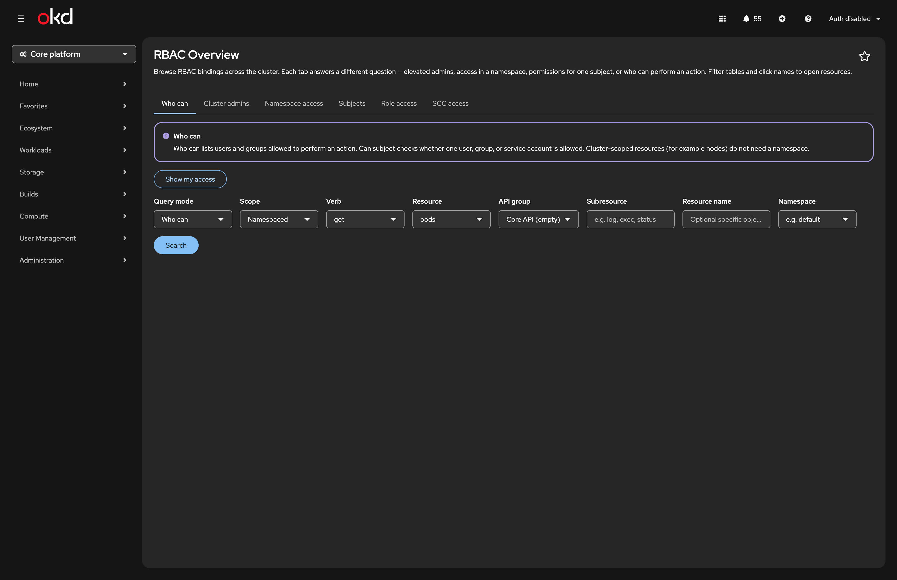
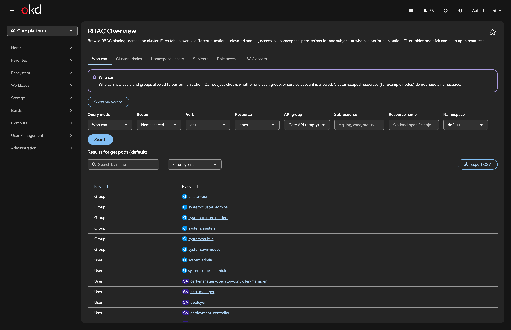
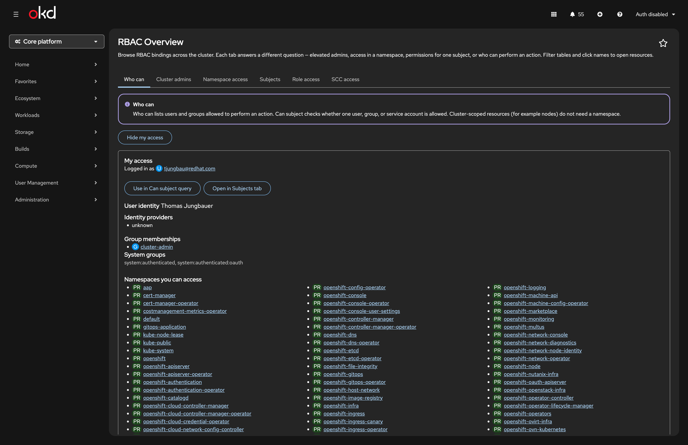
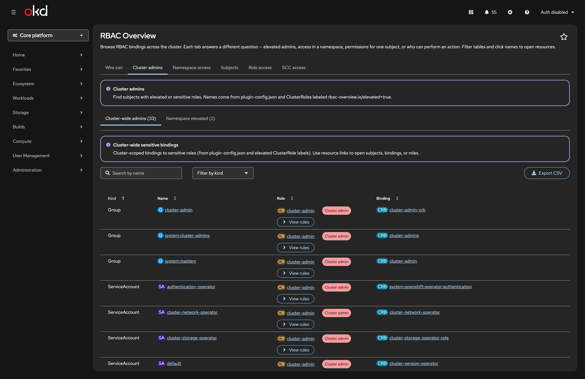
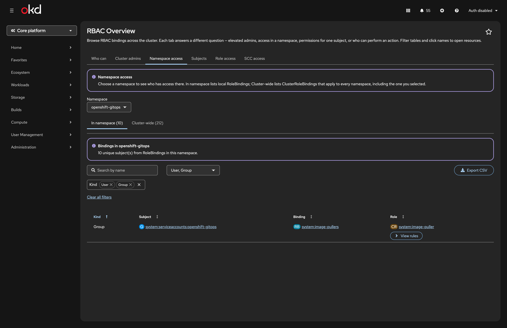
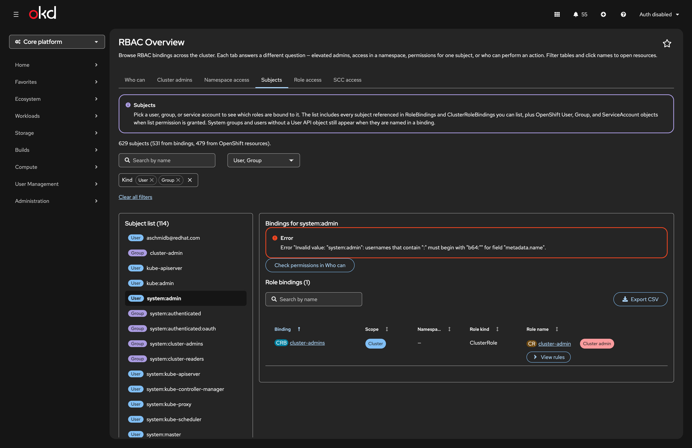
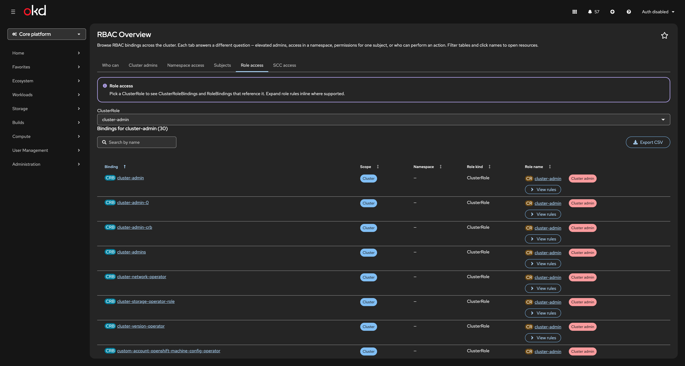
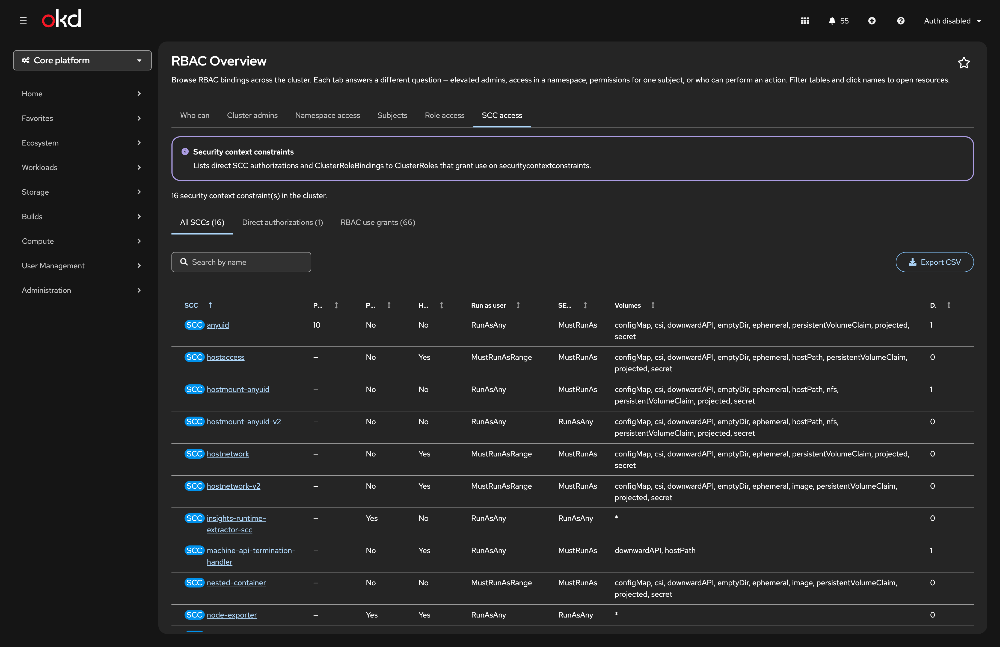

# OpenShift Console RBAC Overview Plugin

Dynamic OpenShift Console plugin that provides a single overview of users, groups, service accounts, and their permissions — who has which roles, who can perform an action, and which identities are on sensitive SCCs.

Tested with OpenShift v4.20+. Open the page at `/rbac-overview` in the **Administrator** perspective (**User Management → RBAC Overview**, above **Users**).

## Screenshots

Screenshots are stored in `[docs/images/](docs/images/)`. They were captured from the local dev console (`http://localhost:9000/rbac-overview`) against a live cluster.


| Tab                   | Preview                                                                                      |
| --------------------- | -------------------------------------------------------------------------------------------- |
| **Who can** (query)   |                                       |
| **Who can** (results) |                             |
| **Show my access**    |                                    |
| **Cluster admins**    |                               |
| **Namespace access**  |                           |
| **Subjects**          |                                           |
| **Role access**       |                                     |
| **SCC access**        |                           |


See the [Features](#features) table below for a concise capability list. Deep links and permission requirements are documented in the sections further down.

## Features


| Tab                  | Description                                                                                                                                                                                                                                               |
| -------------------- | --------------------------------------------------------------------------------------------------------------------------------------------------------------------------------------------------------------------------------------------------------- |
| **Who can**          | List who may perform an action (`ResourceAccessReview` / `LocalResourceAccessReview`) or check one subject (`SubjectAccessReview`). **Show my access** summarises the logged-in user (groups, visible namespaces, role bindings) via `SelfSubjectReview`. |
| **Cluster admins**   | Cluster-wide `cluster-admin` bindings and namespace-scoped `admin` / `cluster-admin` RoleBindings (inner sub-tabs)                                                                                                                                        |
| **Namespace access** | Pick a namespace; list RoleBindings in that namespace and cluster-wide ClusterRoleBindings                                                                                                                                                                |
| **Subjects**         | Browse users, groups, and service accounts (from bindings and OpenShift APIs); inspect all bindings for a selected subject                                                                                                                                |
| **Role access**      | Pick a ClusterRole and list ClusterRoleBindings and RoleBindings that reference it                                                                                                                                                                        |
| **SCC access**       | All SCCs overview table, direct users/groups/service accounts on each SCC, plus RBAC `use` grants (inner sub-tabs)                                                                                                                                          |


All data tables support **sorting**, **filters** (kind + name), **pagination**, and **CSV export** where useful. Resource names link to console detail pages. Role columns include **View rules** to expand ClusterRole / Role policy rules inline.

Each tab shows **specific permission warnings** when your user cannot list the required resources (for example “cannot list users”).

**Sensitive roles** for the Cluster admins tab are configured via Helm `pluginConfig` values (mounted as `plugin-config.json`). Add role names or label ClusterRoles with `rbac-overview.io/elevated: "true"`.

### Deep links


| URL                                                                                                                                   | Opens                                       |
| ------------------------------------------------------------------------------------------------------------------------------------- | ------------------------------------------- |
| `/rbac-overview`                                                                                                                      | Who can (default)                           |
| `/rbac-overview?tab=namespace-access&namespace=kube-system`                                                                           | Namespace access for `kube-system`          |
| `/rbac-overview?tab=subjects&kind=User&name=alice`                                                                                    | Subjects with user `alice` selected         |
| `/rbac-overview?tab=subjects&kind=ServiceAccount&name=default&subjectNamespace=kube-system`                                           | Service account selection                   |
| `/rbac-overview?tab=who-can&whoCanMode=can-subject&verb=get&resource=pods&namespace=default&subjectKind=User&subjectName=alice&run=1` | Who can → Can subject with auto-run         |
| `/rbac-overview?tab=namespace-access&namespace=kube-system&section=cluster-wide`                                                      | Namespace access → Cluster-wide sub-tab     |
| `/rbac-overview?tab=scc`                                                                                                              | SCC access tab                              |
| `/rbac-overview?section=namespace-elevated`                                                                                           | Cluster admins → Namespace elevated sub-tab |


## Prerequisites

- OpenShift 4.10+ (dynamic console plugins)
- Node.js 22+ and npm (host webpack build; see `scripts/build-install.sh`)
- Helm 3+ (cluster install)
- `oc` logged into a cluster (for local testing and deploy)
- Podman (or Docker) for image builds

## Local development

Install dependencies once:

```bash
cd openshift-console-rbac-overview
npm install
```

For day-to-day UI work, use **manual local testing** below (webpack dev server + local console container). That loads the plugin from your working tree without building an image or running Helm.

## Manual local testing

This is the recommended way to validate UI and behaviour before `npm run build` and cluster deploy.

### What runs where


| Process                       | Command                 | URL / role                                                                                                     |
| ----------------------------- | ----------------------- | -------------------------------------------------------------------------------------------------------------- |
| Plugin webpack dev server     | `npm run start`         | **[http://localhost:9001](http://localhost:9001)** — serves `plugin-manifest.json`, JS bundles, locales        |
| OpenShift console (container) | `npm run start-console` | **[http://localhost:9000](http://localhost:9000)** — loads the plugin from the dev server via `BRIDGE_PLUGINS` |
| Cluster API                   | your `oc` session       | Real RBAC data; permissions match the logged-in user                                                           |


The console container is **off-cluster** mode: it uses your `oc` bearer token to call the API server you are logged into. You are not testing the Helm/nginx deployment in this flow.

### Step 1 — Log in to a cluster (token required)

```bash
oc login https://<api-url>:6443 -u <user> -p '<password>'
oc whoami --show-token   # must print a token, not an error
```

If you only have an installer `kubeconfig` (client certificate, no token), `npm run start-console` exits with an error. Use `oc login` with username/password or `--token=` first.

Optional gate before manual testing:

```bash
npm run lint
npm test
```

### Step 2 — Start the plugin dev server (terminal 1)

```bash
npm run start
```

Leave this running. Webpack watches `src/` and writes to `dist/` (`writeToDisk: true`). Locale changes under `locales/` are copied on rebuild.

### Step 3 — Start the local console (terminal 2)

```bash
npm run start-console
```

On **Apple Silicon**, pull the amd64 console image explicitly:

```bash
CONSOLE_IMAGE_PLATFORM=linux/amd64 npm run start-console
```

Override the console image if needed (must match your cluster major version, e.g. 4.21):

```bash
CONSOLE_IMAGE=quay.io/openshift/origin-console:4.21 npm run start-console
```

### Step 4 — Open the plugin

1. Browser: **[http://localhost:9000](http://localhost:9000)**
2. Perspective: **Administrator**
3. Navigation: **User Management → RBAC Overview** (or `/rbac-overview`)

Hard-refresh the browser after larger webpack rebuilds if the tab looks stale (`Cmd+Shift+R` / `Ctrl+Shift+R`).

### Step 5 — Manual test checklist

Use a cluster where you have both an admin and a normal user account (or two `oc login` sessions in different terminals/browsers).


| Area                 | What to verify                                                                                                                               |
| -------------------- | -------------------------------------------------------------------------------------------------------------------------------------------- |
| **Tab bar**          | **Who can** is first and always visible; other tabs appear only when you have list/review permissions                                        |
| **Who can**          | Query mode / scope dropdowns; namespaced query needs a real namespace (not All projects); **Show my access** panel; Can subject result cards |
| **Cluster admins**   | Inner tabs **Cluster-wide admins** / **Namespace elevated**; sort, filter, pagination; **View rules** expands full-width below the row       |
| **Namespace access** | Namespace picker; default kind filter User + Group; inner tabs for namespace vs cluster-wide bindings                                        |
| **Subjects**         | Subject list from bindings + APIs; select a subject; bindings table; link to **Who can → Can subject**                                       |
| **SCC access**       | Direct vs RBAC inner tabs; filters and table export                                                                                          |
| **Deep links**       | URLs in [Deep links](#deep-links) open the correct tab and selection                                                                         |
| **Permissions**      | As a restricted user: hidden tabs, **Limited visibility** alerts, no infinite spinners on blocked data                                       |


## Container image (Project Hummingbird)

The plugin is served as static files over **HTTPS on port 9443** (required by the OpenShift `ConsolePlugin` API). The runtime image uses **[Project Hummingbird](https://hummingbird-project.io/)** — Red Hat’s minimal, hardened container images (`registry.access.redhat.com/hi/`).

### Why Hummingbird instead of UBI?


|                         | UBI `nodejs-22` / `nginx-120`                | Hummingbird `hi/nodejs` + `hi/nginx`                           |
| ----------------------- | -------------------------------------------- | -------------------------------------------------------------- |
| **Purpose**             | Full RHEL userland                           | Distroless/minimal — only what the workload needs              |
| **CVE surface**         | Many OS packages show up in Quay/Clair scans | Far smaller images; near-zero CVE goal                         |
| **User**                | UID 1001                                     | UID **65532** (non-root by default)                            |
| **Fit for this plugin** | Works, but carries unused RPMs               | Host webpack build; minimal `hi/nginx` runtime image only      |


The plugin has no server-side logic in the container: **webpack runs on the host** (or CI) and writes `dist/`; the image only copies those static files into Hummingbird nginx.

### Dockerfile layout

```text
Host build         Node.js 22 + npm/webpack → dist/          (scripts/build-install.sh step 1)
Container image    registry.access.redhat.com/hi/nginx:latest  COPY dist/ + nginx.conf → :9443 TLS
```

The `Dockerfile` is **single-stage** — no in-container `npm ci`. That keeps image builds small and avoids duplicating `node_modules` in the build context. `scripts/build-install.sh` runs `npm run build` first, then `podman build`.

Runtime uses [Red Hat Hardened Images](https://images.redhat.com/?search=nginx&name=nginx&tab=tags&version=latest) (`registry.access.redhat.com/hi/nginx`).

Shared nginx config: `chart/rbac-overview/files/nginx.conf` (baked into the image at build time). It is tuned for non-root Hummingbird nginx: `worker_processes 1`, IPv4-only listen on 9443, pid/temp paths under `/tmp`, TLS certs from the OpenShift serving-cert secret at `/var/cert`. Helm only overrides `plugin-config.json` via ConfigMap.

The Helm chart mounts an `emptyDir` at `/tmp`, a startup probe (serving-cert injection can take time), and readiness/liveness probes on `https://:9443/plugin-manifest.json`.

## Deploy on a cluster

Full pipeline: **webpack build → container image → push → Helm install → verify**.

### Prerequisites

```bash
oc login https://<api-url>:6443 -u <user> -p '<password>'
podman login quay.io    # if your Quay repo is private
```

### One command (build + push + Helm)

```bash
cd openshift-console-rbac-overview
chmod +x scripts/build-install.sh

# Uses package.json version by default (currently 1.0.0)
QUAY_USER=<user> ./scripts/build-install.sh

# Or pin an explicit version:
VERSION=1.0.0 QUAY_USER=<user> ./scripts/build-install.sh

# Same via npm:
QUAY_USER=<user> npm run deploy
```

The script runs:

1. `npm run build` — plugin assets into `dist/`
2. `podman build` — image `quay.io/<user>/openshift-console-rbac-overview:<version>` (see [Container image](#container-image-project-hummingbird))
3. `podman push` — publish to Quay
4. `helm upgrade --install` — Deployment, Service, ConfigMap, ConsolePlugin, enable hook
5. `scripts/verify-deployment.sh` — rollout + plugin checks

Options:


| Variable      | Default                                              | Purpose                                          |
| ------------- | ---------------------------------------------------- | ------------------------------------------------ |
| `VERSION`     | `package.json` version                               | Image tag and Helm `image.tag`                   |
| `QUAY_USER`   | `tjungbau`                                           | Quay namespace                                   |
| `IMAGE_REPO`  | `quay.io/$QUAY_USER/openshift-console-rbac-overview` | Full repository path                             |
| `PLATFORM`    | `linux/amd64`                                        | `podman build --platform` (use on Apple Silicon) |
| `SKIP_VERIFY` | `false`                                              | Set `true` to skip post-install checks           |


Helm-only (image already pushed): use `npm run verify-deployment` after a manual `helm upgrade --install` with matching `image.tag`.

### Test an upgrade (two steps)

You cannot upgrade what is not installed. **Step 1** creates the baseline; **step 2** is the actual upgrade test.

```bash
# Step 1 — baseline install (once; creates namespace + helm release)
VERSION=1.0.0 ./scripts/build-install.sh

# Step 2 — upgrade test (bump VERSION / package.json first, e.g. 1.0.1)
VERSION=1.0.1 ./scripts/helm-upgrade.sh
```

`helm-upgrade.sh` refuses to run if the namespace or release is missing and prints the baseline command.

Chart reference: `chart/rbac-overview/README.md`

### GitOps (management cluster)

A wrapper chart in [openshift-clusterconfig-gitops](https://github.com/tjungbauer/openshift-clusterconfig-gitops) installs the upstream chart from this repository:

```
clusters/management-cluster/setup-rbac-overview/
```

It depends on the Helm repository published from `helm-repo/` (`https://tjungbauer.github.io/openshift-console-rbac-overview`). Package a new release with `npm run helm:package-repo`, publish `helm-repo/` to GitHub Pages, then bump the dependency in the GitOps wrapper.

## Required permissions


| Tab                  | Typical permissions                                                                                               |
| -------------------- | ----------------------------------------------------------------------------------------------------------------- |
| Cluster admins       | `list clusterrolebindings`, `list rolebindings` (all namespaces)                                                  |
| Namespace access     | `list projects`, `list rolebindings`, `list clusterrolebindings`                                                  |
| Subjects             | `list users`, `list groups`, `list serviceaccounts`, binding list permissions                                     |
| Who can (namespaced) | `create localresourceaccessreviews` in target namespace                                                           |
| Who can (cluster)    | `create resourceaccessreviews`                                                                                    |
| Can subject          | `create subjectaccessreviews` or `create localsubjectaccessreviews`                                               |
| My access (Who can)  | `create selfsubjectreviews`; namespaces and bindings use the same list permissions as Subjects / Namespace access |
| Role access          | `list clusterroles`, `list clusterrolebindings`, `list rolebindings`                                              |
| SCC access           | `list securitycontextconstraints`, `list clusterroles`, `list clusterrolebindings`                               |


Restricted users see only **tabs they can use** (at least one required permission), except **Who can** which stays available for Can subject and **Show my access**. Tabs you cannot access are hidden. On tabs you can open, a **Limited visibility** warning describes any missing list or review permissions instead of an endless loading spinner. Namespaced permission checks use your current project or first accessible namespace — not hardcoded `default`.

## Project layout

```
openshift-console-rbac-overview/
├── chart/rbac-overview/          # Helm chart (cluster install)
├── helm-repo/                    # Packaged chart + index.yaml (GitHub Pages)
│   └── files/nginx.conf          # nginx TLS :9443 config (Hummingbird / non-root)
├── config/plugin-config.json     # Default plugin config (webpack → dist/)
├── console-extensions.json       # Console route + nav
├── docs/images/                  # README and documentation screenshots
├── scripts/build-install.sh      # Build image + helm upgrade --install
├── src/components/
│   ├── RbacOverviewPage.tsx      # Plugin exposed module
│   ├── RbacOverviewPageView.tsx  # Page shell + tabs
│   └── rbac-overview/
│       ├── tabRegistry.ts       # Tab key → component map
│       ├── *Tab.tsx / use*Tab.ts # One pair per feature tab
│       └── ...
└── Dockerfile                    # Hummingbird hi/nginx (copies pre-built dist/)
```

## Developer guide

```bash
npm run lint          # TypeScript + ESLint (run before manual testing or PR)
npm test              # Unit tests (URL params, tab access, rbac helpers, …)
npm run helm:lint     # Chart validation
npm run build-dev     # One-off webpack build without minify (optional)
```

See [Manual local testing](#manual-local-testing) for the full UI workflow.

## Troubleshooting

### Helm install / upgrade errors


| Error                                     | Cause                                                         | Fix                                                                                                                     |
| ----------------------------------------- | ------------------------------------------------------------- | ----------------------------------------------------------------------------------------------------------------------- |
| `namespaces "rbac-overview" not found`    | Upgrade flags used but namespace was deleted                  | Add `--create-namespace`, keep `--set namespace.create=false`                                                           |
| `original object Namespace ... not found` | `--create-namespace` **and** `namespace.create=true` together | Use only one: `--create-namespace` + `namespace.create=false`                                                           |
| `invalid ownership metadata`              | Resources from old `kubectl apply`                            | `./scripts/adopt-helm.sh` or delete namespace + fresh install                                                           |
| Deployment `0/1`, Helm `--wait` timeout   | Pod not Ready (Hummingbird/nginx, serving cert, probes)       | `oc -n rbac-overview logs deploy/rbac-overview`; ensure `rbac-overview-cert` secret exists; re-run with `--timeout 10m` |


Fresh install:

```bash
helm upgrade --install rbac-overview ./chart/rbac-overview \
  --namespace rbac-overview \
  --create-namespace \
  --set namespace.create=false \
  --set image.tag=<version> \
  --wait
```

Upgrade (namespace + release already exist):

```bash
helm upgrade --install rbac-overview ./chart/rbac-overview \
  --namespace rbac-overview \
  --set namespace.create=false \
  --set image.tag=<version> \
  --wait
```

### `/rbac-overview` shows 404

1. **React / SDK mismatch** — OCP 4.21 console uses React 17. Match `@openshift-console/dynamic-plugin-sdk@4.21-latest`.
2. **Wrong perspective** — use **Administrator**.
3. **Plugin not enabled** — `oc get console.operator cluster -o jsonpath='{.spec.plugins}'`
4. Hard refresh after redeploy.

### Tab labels show raw keys (e.g. `tab.roleAccess`)

New UI strings come from `/locales/en/plugin__rbac-overview.json`. That file is served at a **stable URL** (no content hash), so browsers or the console can keep an older copy after you upgrade the plugin image while the JavaScript bundles already reference new keys.

**1. Confirm the running pod serves the new strings** (not just the image tag):

```bash
oc port-forward -n rbac-overview svc/rbac-overview 9443:9443 &
sleep 2
curl -sk https://127.0.0.1:9443/locales/en/plugin__rbac-overview.json | jq '."tab.roleAccess"'
kill %1
```

- `"Role access"` — image is correct; clear client/console cache (steps 2–3).
- `null` or missing — rebuild and push the image (`./scripts/build-install.sh`), then verify with `./scripts/verify-deployment.sh`.

**2. Restart OpenShift console pods** so preloaded i18n is refetched:

```bash
oc rollout restart deployment/console -n openshift-console
oc rollout status deployment/console -n openshift-console
```

**3. Hard-refresh the browser** (or use a private window) on the console URL.

Chart images from 1.0.5 onward send `Cache-Control: no-store` for `/locales/` to reduce stale translations after upgrades.

### Who can returns permission errors

Who-can and can-subject require elevated permissions (same as `oc adm policy who-can`). Enter a real namespace — the **All projects** view (`#ALL_NS#`) cannot be used.

## Configuring sensitive roles

Via Helm:

```bash
helm upgrade rbac-overview ./chart/rbac-overview \
  --reuse-values \
  --set-json 'pluginConfig.sensitiveRoles=["cluster-admin","admin","my-custom-power-role"]'
```

Or patch the ConfigMap directly. Restart the deployment after changes.

## Limitations

- Role rules show the Role / ClusterRole object, not fully computed effective permissions across aggregation
- SCC tab has **Direct** and **RBAC** inner tabs; the RBAC view derives grants from ClusterRole `rules` and bindings (`sccRbac.ts`) — it does not resolve aggregated ClusterRoles or prove runtime SCC admission
- Who-can / can-subject require authorization API create permissions

## References

- [Project Hummingbird](https://hummingbird-project.io/) — Red Hat Hardened Images (`registry.access.redhat.com/hi/`)
- [OpenShift Console Plugin SDK](https://github.com/openshift/console/tree/main/frontend/packages/console-dynamic-plugin-sdk)
- [Console plugin template](https://github.com/openshift/console-plugin-template)
- [OpenShift dynamic plugins documentation](https://docs.openshift.com/container-platform/latest/web_console/dynamic-plugins-overview.html)

